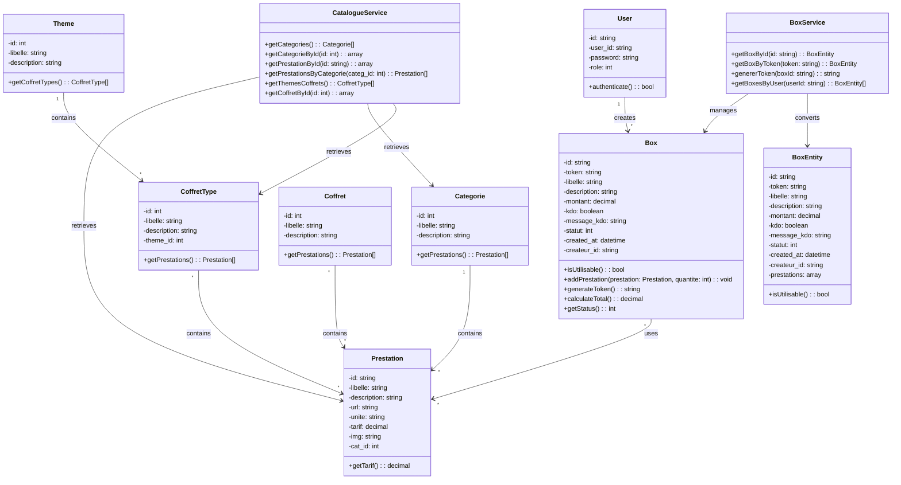

# MyGiftBox.net - Cahier des Charges et Domaine

## 📋 Vue d'ensemble

**MyGiftBox.net** est une plateforme web de gestion de boîtes cadeaux. Elle permet aux utilisateurs de créer des boîtes cadeaux personnalisées en sélectionnant des prestations (services/produits) provenant d'un catalogue organisé par catégories et thèmes.

---

## 🎯 Fonctionnalités Identifiées

### 1. **Gestion du Catalogue**

#### 1.1 Consultation des Catégories
- **Description**: Afficher la liste complète des catégories de prestations disponibles
- **Entités concernées**: `Categorie`
- **Cas d'usage**: Liste des catégories avec libellé et description
- **Route**: `GET /categories`

#### 1.2 Consultation des Prestations
- **Description**: Afficher toutes les prestations disponibles ou filtrer par catégorie
- **Entités concernées**: `Prestation`, `Categorie`
- **Cas d'usage**: 
  - Liste complète des prestations
  - Prestations filtrées par catégorie
  - Détails d'une prestation (tarif, description, image, URL)
- **Routes**: 
  - `GET /prestations`
  - `GET /prestation/{id}`
  - `GET /categorie/{id}/prestations`

#### 1.3 Consultation des Thèmes et Coffrets-Types
- **Description**: Afficher les coffrets-types thématiques prédéfinis
- **Entités concernées**: `Theme`, `Coffret_type`, `Prestation`
- **Cas d'usage**: 
  - Liste des coffrets-types par thème
  - Détails d'un coffret-type (prestations incluses)
- **Routes**: 
  - `GET /coffret_types`
  - `GET /coffret_type/{id}`

---

### 2. **Gestion des Boîtes Cadeaux**

#### 2.1 Création d'une Boîte Cadeau
- **Description**: Permettre à un utilisateur de créer une nouvelle boîte cadeau vierge
- **Entités concernées**: `Box`, `User`
- **Fonctionnalités**:
  - Créer une boîte avec libellé et description
  - Définir un montant cible (optionnel)
  - Marquer comme "cadeau" (kdo) avec message personnel
  - La boîte est créée en statut "BROUILLON"
- **Statuts de boîte**:
  - `BROUILLON (1)`: Création en cours
  - `EN_ATTENTE (2)`: En attente de traitement
  - `PAYE (3)`: Paiement effectué
  - `VALIDE (4)`: Validée
  - `ACTIF (5)`: Peut être utilisée/partagée

#### 2.2 Composition de la Boîte Cadeau
- **Description**: Ajouter et gérer les prestations dans une boîte
- **Entités concernées**: `Box`, `Prestation`, `Box2Presta`
- **Fonctionnalités**:
  - Ajouter une prestation avec quantité
  - Modifier la quantité d'une prestation
  - Supprimer une prestation
  - Calculer le montant total automatiquement

#### 2.3 Génération du Token de Partage
- **Description**: Générer un identifiant unique pour partager la boîte
- **Entités concernées**: `Box`
- **Fonctionnalités**:
  - Générer un token sécurisé (hex de 32 bytes aléatoires)
  - Persister le token dans la base de données
  - Permettre l'accès à la boîte via ce token
- **Routes**: 
  - `GET /box/{id}/token` (générer ou récupérer)

#### 2.4 Consultation d'une Boîte Cadeau
- **Description**: Accéder aux détails d'une boîte via son token
- **Entités concernées**: `Box`, `Prestation`, `User`
- **Fonctionnalités**:
  - Récupérer les prestations avec quantités
  - Afficher le montant total
  - Afficher le message cadeau le cas échéant
  - Vérifier que la boîte est active
- **Routes**: 
  - `GET /box/{token}`

#### 2.5 Gestion des Boîtes par Utilisateur
- **Description**: Consulter toutes les boîtes créées par un utilisateur
- **Entités concernées**: `Box`, `User`
- **Fonctionnalités**:
  - Lister les boîtes triées par date de création
  - Afficher le statut de chaque boîte

#### 2.6 Modification du Statut de Boîte
- **Description**: Gérer la transition d'états de la boîte
- **Entités concernées**: `Box`
- **Transitions de statut**:
  - BROUILLON → EN_ATTENTE → PAYE → VALIDE → ACTIF

---

### 3. **Gestion des Utilisateurs**

#### 3.1 Authentification
- **Description**: Gérer l'authentification des utilisateurs
- **Entités concernées**: `User`
- **Données stockées**:
  - ID unique
  - user_id (login)
  - password (hashé)
  - role (permissions)

---

## 🏗️ Entités du Domaine

### 1. **User** (Utilisateur)
```
Attributs:
  - id: VARCHAR(40) - Identifiant unique
  - user_id: VARCHAR(128) - Login unique
  - password: VARCHAR(256) - Mot de passe hashé
  - role: TINYINT - Rôle/Permission

Relations:
  - Crée N boîtes cadeaux (Box)
```

### 2. **Categorie** (Catégorie)
```
Attributs:
  - id: INT - Identifiant auto-incrémenté
  - libelle: VARCHAR(128) - Nom de la catégorie
  - description: TEXT - Description détaillée

Relations:
  - Contient N prestations (Prestation)
```

### 3. **Prestation** (Service/Produit)
```
Attributs:
  - id: VARCHAR(128) - Identifiant unique
  - libelle: VARCHAR(128) - Nom de la prestation
  - description: TEXT - Description détaillée
  - url: VARCHAR(256) - Lien URL (optionnel)
  - unite: VARCHAR(128) - Unité de mesure
  - tarif: DECIMAL(10,2) - Prix unitaire
  - img: VARCHAR(128) - Chemin de l'image
  - cat_id: INT - Clé étrangère vers Categorie

Relations:
  - Appartient à 1 Categorie
  - Peut être dans N Box (Box2Presta - many-to-many)
  - Peut être dans N Coffret (Coffret2Presta - many-to-many)
  - Peut être dans N Coffret_type (via Coffret2Presta)
```

### 4. **Theme** (Thème)
```
Attributs:
  - id: INT - Identifiant auto-incrémenté
  - libelle: VARCHAR(128) - Nom du thème
  - description: TEXT - Description détaillée

Relations:
  - Contient N coffrets-types (Coffret_type)
```

### 5. **Coffret_type** (Type de Coffret Prédéfini)
```
Attributs:
  - id: INT - Identifiant auto-incrémenté
  - libelle: VARCHAR(128) - Nom du coffret-type
  - description: TEXT - Description détaillée
  - theme_id: INT - Clé étrangère vers Theme

Relations:
  - Appartient à 1 Theme
  - Contient N prestations (Coffret2Presta - many-to-many)
```

### 6. **Coffret** (Coffret - Table auxiliaire)
```
Attributs:
  - id: INT - Identifiant auto-incrémenté
  - libelle: VARCHAR(128) - Nom du coffret
  - description: TEXT - Description détaillée

Relations:
  - Contient N prestations (Coffret2Presta - many-to-many)
```

### 7. **Box** (Boîte Cadeau)
```
Attributs:
  - id: VARCHAR(128) - Identifiant unique
  - token: VARCHAR(64) - Token de partage
  - libelle: VARCHAR(128) - Nom de la boîte
  - description: TEXT - Description
  - montant: DECIMAL(12,2) - Montant total
  - kdo: TINYINT - Marqueur cadeau (0 ou 1)
  - message_kdo: TEXT - Message personnel
  - statut: INT - État de la boîte (1-5)
  - created_at: DATETIME - Date de création
  - updated_at: DATETIME - Date de modification
  - createur_id: VARCHAR(40) - Clé étrangère vers User

Relations:
  - Créée par 1 User
  - Contient N prestations (Box2Presta - many-to-many avec quantité)
```

### 8. **Box2Presta** (Association Box-Prestation)
```
Attributs:
  - box_id: VARCHAR(128) - Clé étrangère vers Box
  - presta_id: VARCHAR(128) - Clé étrangère vers Prestation
  - quantite: INT - Quantité de cette prestation dans la boîte

Relations:
  - Pivot table reliant Box et Prestation
```

### 9. **Coffret2Presta** (Association Coffret-Prestation)
```
Attributs:
  - coffret_id: INT - Clé étrangère vers Coffret
  - presta_id: VARCHAR(128) - Clé étrangère vers Prestation

Relations:
  - Pivot table reliant Coffret et Prestation
```

---

## 📊 Diagramme UML du Domaine

```mermaid
erDiagram
    USER ||--o{ BOX : creates
    CATEGORIE ||--o{ PRESTATION : contains
    THEME ||--o{ COFFRET_TYPE : contains
    COFFRET_TYPE ||--o{ PRESTATION : "contains via Coffret2Presta"
    BOX ||--o{ PRESTATION : "contains via Box2Presta"
    COFFRET ||--o{ PRESTATION : "contains via Coffret2Presta"
    
    USER {
        string id PK
        string user_id UK
        string password
        int role
    }
    
    CATEGORIE {
        int id PK
        string libelle
        text description
    }
    
    PRESTATION {
        string id PK
        string libelle
        text description
        string url
        string unite
        decimal tarif
        string img
        int cat_id FK
    }
    
    THEME {
        int id PK
        string libelle
        text description
    }
    
    COFFRET_TYPE {
        int id PK
        string libelle
        text description
        int theme_id FK
    }
    
    COFFRET {
        int id PK
        string libelle
        text description
    }
    
    BOX {
        string id PK
        string token
        string libelle
        text description
        decimal montant
        tinyint kdo
        text message_kdo
        int statut
        datetime created_at
        datetime updated_at
        string createur_id FK
    }
    
    BOX2PRESTA {
        string box_id FK PK
        string presta_id FK PK
        int quantite
    }
    
    COFFRET2PRESTA {
        int coffret_id FK PK
        string presta_id FK PK
    }
```

---

## 🔄 Diagramme des Classes du Domaine



---

## 📌 Cas d'Utilisation Principaux

### Scénario 1: Créer et Partager une Boîte Cadeau
1. Utilisateur authentifié crée une boîte cadeau (statut: BROUILLON)
2. Utilisateur ajoute des prestations du catalogue avec quantités
3. Système calcule le montant total automatiquement
4. Utilisateur génère un token de partage
5. Utilisateur partage le lien avec le token
6. Autres utilisateurs accèdent à la boîte via le token
7. La boîte doit être en statut ACTIF pour être accessible

### Scénario 2: Parcourir le Catalogue
1. Utilisateur consulte la liste des catégories
2. Utilisateur sélectionne une catégorie
3. Système affiche les prestations de cette catégorie
4. Utilisateur peut consulter les détails d'une prestation
5. Utilisateur peut explorer les coffrets-types thématiques

### Scénario 3: Utiliser un Coffret Prédéfini
1. Utilisateur consulte les coffrets-types
2. Utilisateur sélectionne un coffret d'un thème spécifique
3. Système affiche les prestations du coffret
4. Utilisateur peut créer une boîte en se basant sur le coffret

---

## 🏛️ Architecture en Couches

Le projet suit une architecture multi-couches:

```
├── infrastructure/          # Modèles Eloquent (accès données)
├── application_core/
│   ├── application/         # Services d'application (cas d'usage)
│   │   └── usecases/
│   │       ├── BoxService
│   │       └── CatalogueService
│   └── domain/              # Entités et exceptions du domaine
│       ├── entities/
│       └── exceptions/
├── webui/                   # Présentation web (actions, vues)
│   └── actions/
├── business/                # Logique métier (si nécessaire)
└── cli/                     # Tests en ligne de commande
```

---

## 📝 Notes Importantes

1. **Token de Partage**: Le token est généré une seule fois et réutilisé (pas de regénération)
2. **Statuts de Boîte**: Cinq niveaux pour gérer le cycle de vie complet
3. **Tarification**: Les prix sont stockés au niveau de la Prestation
4. **Isolement du Domaine**: Les entités du domaine (`BoxEntity`, etc.) sont séparées des modèles de données (`Box`, etc.)
5. **Gestion des Erreurs**: Le système lance des exceptions typées (`BoxException`, `EntityNotFoundException`, etc.)

---

## 🔐 Sécurité

- Tokens générés avec `random_bytes(32)` converti en hexadécimal
- Mots de passe stockés hashés
- Rôles définis dans la table User pour contrôler les permissions
- Validation des statuts de boîte pour éviter les accès non autorisés
